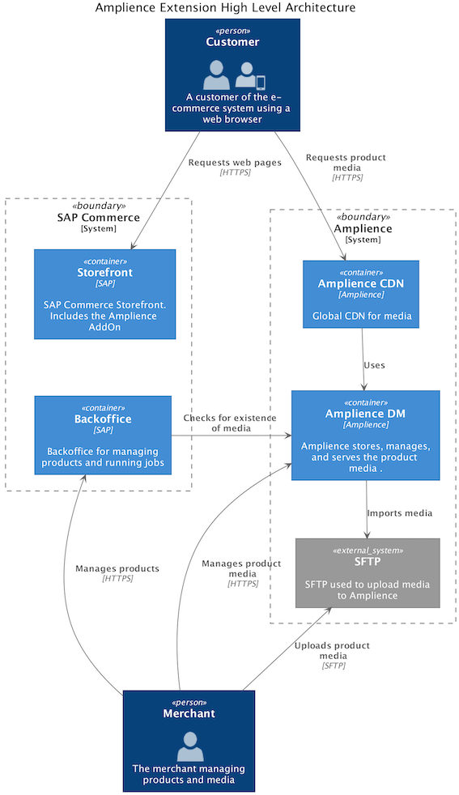

# Amplience Extension Integration

## Introduction

Amplience Dynamic Media (DM) is a powerful automated image and video management service which includes dynamic imaging
and video transcoding capabilities, metadata, viewer configuration, reporting, and analytics.
The service will dynamically render any image variant on demand from a single master asset based on URL parameters
(e.g. width and height), reducing drastically the number of assets that need to be created and maintained.
The Amplience DM assets are served from a high performance CDN which improves the performance of the storefront.

The document assumes a level of knowledge of both Amplience Dynamic Media and SAP Commerce and is not intending to be a
user guide to either of these applications, instead focusing on the integration between the two.

This extension enables a number of scenarios for using Amplience Dynamic Media images within the SAP Commerce B2C
Accelerator and for presentation of product imagery within the storefront. The extension is based on SAP Commerce 2211
and provides an addon for the Accelerator storefront. There is a demo extension that shows how Amplience could be
integrated with the Apparel data model and sample product data.

Amplience Dynamic Media is a Software-as-a-Service platform, and, as such, all integration points are in the front end
code, using a URL call mechanism.

At a high level, the extension enables the following features:

* SAP Commerce B2C Accelerators
* SAP Commerce Backoffice
  * Display the Product image from Amplience in the product list, grid
* Apparel Storefront
  * The extension updates the Storefront to use Amplience dynamic media for all product media
  * Product list page
    * Product images
    * Layering of additional overlay images over the product images, e.g. Roundels
  * Product quick view lightbox
    * Main product image
    * Product image gallery
  * Product details page
    * Main product image
    * Product image gallery
    * Swatch images for variations of the product (e.g. colours)
  * Shopping bag lightbox
    * Product thumbnail and Swatch image
  * Shopping bag
    * Order lines product thumbnail
  * Collect In Store lightbox
    * Product thumbnail

This guide contains some URLs to the SAP Commerce Accelerator Apparel Demo storefront in order to provide examples of
functionality. This assumes that you have the Apparel Demo storefront with the Amplience Extension installed as per the
Installation Guide. The URLs to the storefront assume that you are running SAP Commerce on hostnames `apparel-uk.local`
and `apparel-de.local`.

The Amplience Dynamic Media extensions are pre-configured to work with an Amplience DM account called `hybrisext`, this
account already has all the product media from the SAP Commerce Apparel Accelerator Demo Store loaded. This means that
you can take the vanilla Apparel Accelerator, install the Amplience Dynamic Media extensions and start SAP Commerce and
use the Apparel storefront without having to setup an Amplience DM account.


## Concepts

### Product Item Structure

The Apparel demo store models products using a 3-level hierarchy, which is used for determining the naming of media
strings used in the URLs.

* Apparel Product
  * The generic product available for sale, e.g. Trace Helm helmet. There is no product media at this level in the
    hierarchy. The product has one or more style variants which have media.
* Style Product
  * A Style variant of the generic product e.g. Trace Helm Lime helmet. The Style (which is essentially the same as
    colour) identifies the visual differences between the style variations of the product. The product media is held at
    this level.
* Size Product
  * A size variant of the Style item – this is a SKU that can be purchased. There are no product media held at this
    level; to determine the correct image for the SKU, use the media for the style variant.

The `ampliencedmacceleratordemo` extension provides a `ApparelAmplienceProductResolver` implementation that is
specific to the Apparel data model and supports its 3-level hierarchy. If your storefront uses a different product
data model this would have to be changed in your implementation.


### High Level Architecture

* The product media must be uploaded or imported into Amplience.
* The Amplience Extension's storefront addon builds product images links based on product's code.
* The storefront displays product media loaded from the Amplience CDN.



### Product Media Migration

#### Product Media Exists In SAP Commerce.

Product media can be exported from SAP Commerce and uploaded in an SFTP server from which Amplience will import it.
As part of importing the media Amplience can build the various media assets needed for the storefront.
A custom script, `exportImages.groovy`, has been provided in the `ampliencedmacceleratordemo` extension to export the
sample Apparel product images from SAP Commerce. This script is only valid for the Apparel product data model and
will need to be adapted to support a different product data model.

* Product Media is exported from SAP Commerce via custom script.
* The script names the media with the product code.
* The media files must be uploaded or exposed on an SFTP server.
* Amplience pulls the media files to get them uploaded into your Amplience account.
* Amplience import scripts build media sets for each product.

> See section below for more details on the bulk image export process

#### Product Media Not In SAP Commerce.

This could be in a brand new installation or where the media is sourced from another media asset management system.

* Product Media is loaded to the SFTP server from external source.
* The product image media should be renamed to an agreed format with Amplience.
* Amplience pulls the media files to get them uploaded into your Amplience account.
* Amplience import scripts build media sets for each product.

### Media Sets

Amplience DM supports storing 3 types of asset; Images, Videos, and Media Sets. A Media Set is an ordered list of
Amplience assets and can contain any combination of images, videos, or even nested media sets. Each asset in Amplience
has a unique code – which must be unique across all types of assets stored in the account.

The Amplience Playground provides examples of assets hosted within Amplience and allows experimentation with URL
transformation parameters.

* For images see: <http://playground.amplience.com/di/app/#/images>
* For media sets see: <http://playground.amplience.com/di/app/#/sets>

The approach taken in the Amplience Extension is to package all the product's images into a single media set. This media
set is used for both the product's main image and the product's gallery of media.
The name of the media set is based on the product's code with suffix of `ms`, for example`<product-code>-ms`.
The Amplience Extension uses a customisable strategy to select the appropriate product within the 3-layer hierarchy to
use to generate the name of the media set in the URL.

For example, the product with SKU code `300453380` (Lime Trace Helmet Size L) belongs to the style product variant
`102277_lime` which in turn belongs to apparel product `102277`. The URL to the product details page for this product
would be of the form `...../Trace-Helm/p/300453380` and the media set (based on the Style level variant) would be of the
form `...../102277_lime-ms`.

During media import a suffix is added to every product style media (eg 102277_lime-01). When an Amplience media set
URL is referenced without specifying the index of the item from the set Amplience will serve up the first image in the
media set. This behaviour is used so that a single media set can provide the main product image, and the gallery of
product images. The main product image is the first image in the media set. To retrieve a specific image, use a url of
the form `..../102277_lime-ms/X` where `X` is the index of the item.


### URL Structure

Amplience image URLs generated for the Apparel Demo storefront by the Amplience Extension are built using a pre-defined
syntax (below). More details can be found in the Amplience Dynamic Media Playground (<http://playground.amplience.com>).

An example url:
```
https://cdn.media.amplience.net/s/hybrisext/102277_lime-ms/Categories/Helmets/Helmets-Snow/Trace-Helm-lime.jpg?locale=en-GB,en-*,*&fmt=auto&$product$&$roundel$&new=1
```

The URL is broken down as follows:

* The HTTP protocol and DNS hostname
  * The HTTP protocol and DNS hostname. By default the Amplience hostname for images is `cdn.media.amplience.net`.
    This will be your domain where images are hosted – instead of using the default Amplience hostname you can CNAME a
    hostname to the Amplience servers for SEO purposes. This is something you need to request from Amplience.
* Media type
  * States that this image is a media set. Possible values are:
    * `i` - Image
    * `s` - Media Set
    * `v` - Video
* Your Amplience account identifier
  * The extension will use `hybrisext` by default, but this should be changed to your own Amplience account ID.
* Amplience media set asset identifier
  * This is the identifier of the Image, Set, or Video within your Amplience account. e.g. `102277_lime-ms`
* Optional text to support your SEO approach
  * This element is for SEO purposes only, they are not interpreted by Amplience and are not mandatory for the URL to
    return media. e.g. `Categories/Helmets/Helmets-Snow/Trace-Helm-lime.jpg`
* Locale, with defaults
  * This instructs Amplience which locale to use when retrieving image data. In this example the `en-GB` locale is tried
    first, followed by any `en` locale content, finally if no content can be found with the previous locales then return
    any image found for the item identifier. e.g. `locale=en-GB,en-*,*`
* Format
  * Relevant when Amplience Smart Images / Accelerated Media is enabled on the Amplience account
  * When set to `auto` like in this example, Amplience will automatically select the best format for the current browser.
  * By default in this extension, this query parameter is set to `fmt=auto`
* Transformation Templates
  * Transformation Templates are defined in your Amplience account and can be used in URL. Amplience will substitute
    whatever is defined in the template when parsing the URL. The transformation templates can contain any of the URL
    transformation parameters.
  * As these are defined in the Amplience account they can be changed without modifying the storefront or any data
    setup in SAP Commerce.
    * `$product$` - sizes the image for the product list page
      * Content is: `w=300&h=300&sm=MC&upscale=true&filter=l&img404=missing_product`
    * `$roundel$` - defines how overlay roundels are applied
      * Content is: `layer0=[w=1000]&layer1=[src=/i/hybrisext/badge_sale&w=400&right=10&top=10&anchor=TR&visible=$sale]&layer2=[src=/i/hybrisext/badge_new&w=400&left=10&top=10&anchor=TL&visible=$new]&layer3=[src=/i/hybrisext/badge_low_stock&w=400&left=10&bottom=10&anchor=BL&visible=$stock]&new=1`

The URL transformation parameters are parsed from left to right. Duplicate parameters that appear later in the URL will
override earlier ones.


### Naming Conventions

The ID for the Amplience media is generated from the SAP Commerce Product code. The following limitations apply
to the naming of media in Amplience and therefore apply to Amplience image and media set identifiers.

* Asset ID must not include the following characters: `/`, `\`, tab, newline
* Asset ID maximum length must not be longer than 30 characters
* Asset ID must not contain white space
* Avoid characters that need to be specially encoded in web URLs, for example: ``!@£$%^&*()=+{}[]'"|\/><,.~`§±#`` etc.

These restrictions should be applied to the SAP Commerce product code (also referred to as the Article number).

> Note: the Amplience Extension does not include any front end validation on product style names to prevent incorrect
> entry data on product naming as above. If your product code is not suitable for use as an Amplience asset identifier
> then you will have to implement a strategy to resolve this.

#### Naming Convention For Uploaded Product Media

Product media is generally uploaded into your Amplience account via SFTP. Amplience will run a script to import the
uploaded images and organise the product media into media sets. Typically this script is custom written by Amplience for
each customer as each has different naming conventions for their product media.

The scripts expect the following naming convention:

* Main media (for an Apparel style product model): `<product-style-code>-01`
* Alternative media: `<product-style-code>-02`, `<product-style-code>-03`, ... `<product-style-code>-99.jpg`. Any image
  or video file extension supported by Amplience is allowed. The 2 digit number in the file name specifies the position
  in the gallery.
* A single spin set (360 images) is supported per product and the images for the spin set must be named
  `<product-code>-s-01.jpg`, `<product-code>-s-02.jpg` ... `<product-code>-s-99.jpg`. If there is a spin set then it is
  added to the product media set at the last position (a media set inside a media set)
* Swatch media (optional): `<product-style-code>-swatch.jpg`. By default a small version of the main product image is
  used as the swatch image.
* The media set created by the Amplience script will be named `<product-style-code>-ms`.


### Transformation Templates

Amplience DM supports applying transformations to an image via URL parameters. The most common transformation is the
size of the image, although there are many others defined in the Amplience documentation.

Amplience DM also supports pre-defined named groups of parameters that are setup within your Amplience account, these
are also specified on the URL but the actual transformation parameters that are applied are fully managed within the
Amplience account.

The Amplience Dynamic Media extensions use transformation templates rather than applying specific transformation
parameters. This allows the actual transformation parameters to be changed from within the Amplience account without
having to make changes in SAP Commerce or the Amplience Dynamic Media extensions.

SAP Commerce supports the concept of different sizes or formats for each product image. It does this using the
ImageFormat type. Each ImageFormat has unique name. The ImageFormats that SAP Commerce provides are named `product`,
`zoom`, `styleSwatch`, `thumbnail`, and `cartIcon`. The Amplience Dynamic Media extensions use the name of the SAP
Commerce ImageFormat as the Transformation Template used in the URL. For example the thumbnail image is the main product
image with the `thumbnail` Transformation Template applied as a URL parameter. The `thumbnail` Transformation Template
in the Amplience account then controls the transformations that are applied to the image – i.e. resizing the image.

| Transformation Name | Description |
| --- | --- |
| `product` | Sizes the main product image, used for product details page and product list pages |
| `zoom` | Sizes the magnified zoom image of the product on the product details page |
| `styleSwatch` | Sizes a small swatch image, e.g. for style colour variant selection |
| `thumbnail` | Sizes a mid-sized thumbnail product image, e.g. for related products |
| `cartIcon` | Sizes the small product image used in the shopping cart |
| `roundel` | For adding roundels overlays onto product images using layers, e.g. in the product list pages |
| `backoffice` | Added to product image URLs used in the Backoffice |

It is possible for you to define your own Transformation Templates to suit your storefront image requirements. You will
need to create the ImageFormat in SAP Commerce and the Transformation Template in Amplience for this to work.

### URL Variables

Amplience Dynamic Media allows for the use of variables with the URL structure. A variable can be defined using the
`name=value` pattern and can be used by prefixing the name with a dollar `$` sign, for example `$name`.

Variables have been used by the extension to provide dynamic amendment of URLs. Variable are most effective when used in
a Transformation Template. The variables appended to the URL can trigger behaviours delivered in the template.

For example the parameters for the roundel template:
```
layer0=[w=1000]&layer1=[src=/i/hybrisext/badge_sale&w=400&right=10&top=10&anchor=TR&visible=$sale]&layer2=[src=/i/hybrisext/badge_new&w=400&left=10&top=10&anchor=TL&visible=$new]&layer3=[src=/i/hybrisext/badge_low_stock&w=400&left=10&bottom=10&anchor=BL&visible=$stock]
```

This Transformation Template shows 3 variables being set up, to enable the `visible` parameter for each roundel image:
* `sale=1`
* `new=1`
* `stock=1`

These can be provided to in the URL, for example:
```
https://cdn.media.amplience.net/s/hybrisext/102277_lime-ms/Categories/Helmets/Helmets-Snow/Trace-Helm-lime?locale=en-GB,en-*,*&fmt=auto&$product$&$roundel$&sale=1
```
This URL isplays the _Sale_ roundel on the image.


### Localisation

The Amplience Dynamic Media URL strategy supports localisation of images for languages and countries, based on the
standard locales, e.g. `en-GB`, `en-US`. Amplience requires that the locale fall-back sequence is explicit and no
inheritance is assumed. This means that, for example, should the US English version of an image not be available,
Amplience will not assume to check the English default image – this must be explicitly requested using alternative
locales with wildcards. e.g. `locale=en-GB,en-*,*`


## Extensions Overview

There are three extensions included in the Amplience Extension for SAP Commerce solution. These can be found in the
`hybris/bin/ext-amplience` directory.

### ampliencedm

This extension provides the core data model and integration with Amplience DM. All the functionality delivered in this
extension is customisable via SAP Commerce spring configuration. This extension provides a number of strategies that can
be replaced to customise the behaviour, reasonable defaults have been supplied. This extension has dependencies on the
SAP Commerce `commercefacades` and `acceleratorservices` extensions, but it does not depend on any of the sample
Accelerator storefronts.

### ampliencedmaddon

This extension is a SAP Commerce Accelerator AddOn that integrates Amplience DM functionality directly into the
Accelerator Apparel Demo Store template `yacceleratorstorefront` or a project specific storefront based on that
template.

### ampliencedmacceleratordemo

This extension is the only place where the Apparel Demo Store is specifically referred to, be that the data model for
the Apparel product types, or the product and content catalogs, or the CMS content pages setup for the apparel
storefronts.


## Account Configuration Properties

The Amplience Account configuration properties can be set globally and overridden per SAP Commerce Site. There are
2 separate configuration properties that need to be set.

* The Amplience account identifier
  * The Amplience account that holds the product media. There can be a single account for all sites, or a separate
    account for each site.
* The Amplience image CDN hostname
  * The default hostname is fully functional, however if a hostname alias has been setup then the Extension must be
    configured to use it. There can be a single hostname for all sites, or a separate one for each site.

### Global Account Configuration Properties

The global account configuration properties are defined using SAP Commerce properties files.
SAP Commerce has a hierarchical system of properties files. Base configuration can be defined in an extension's
`project.properties` file and still be overridden in the global `local.properties` file.

| Property | Default Value | Description |
| --- | --- | --- |
| `amplience.dm.config.accountIdentifier` | `hybrisext` | The account identifier |
| `amplience.dm.config.imageHostname` | `cdn.media.amplience.net` | The Amplience DM CDN hostname |

The Amplience account identifier set here is to the sample Amplience account that has been preconfigured by Amplience.
You will need to override this with your account identifier.

### Per-site Account Configuration Properties

The Account configuration can be overridden per website within SAP Commerce. This is useful if the websites have
different configurations. To change these settings for a site, open the Backoffice Admin area, navigate to
the Website and open the Amplience tab.

The `Amplience Account Identifier` and `Amplience Image Hostname` attributes of the Website can be set to override
the global account configurations. If these are blank then the global value will be used.


## Bulk Export Of Images

When using the Amplience extension, product images are all held within Amplience Dynamic Media rather than SAP Commerce.
All the product media displayed in the SAP Commerce storefront and the Backoffice Product Cockpit have been changed to
load the images from the Amplience CDN.

If your product images are already in your SAP Commerce system you will want to bulk export the images from SAP Commerce
in order to upload them to Amplience rather than uploading them individually. This is a one-off export process. Once the
images have been exported any new product media must be uploaded directly to Amplience.

The Amplience Extension includes an export utility, `exportImages.groovy`, in the `ampliencedmacceleratordemo` extension
that can be run from the SAP Commerce groovy console. The export utility supports the SAP Commerce Apparel product
hierarchy and exports the images from the product image gallery. This may need to be adapted to match your requirements
and product data model. The groovy script calls the `com.amplience.hybris.dm.util.ExportImages` to perform the export.

The export outputs images files using the naming convention described above (see _Naming Conventions_ section).
This allows the images to be uploaded to Amplience via SFTP and then imported by the Amplience import script, either
using the script provided or modified by Amplience to match your specific configuration.


## Image Status

A missing image report can help to identify products that do not yet have the required product media setup in
Amplience. This consists of a cron job and a report.

### Image Status Cron Job

The `AmplienceProductImageStatusUpdateCronJob` executes the `AmplienceProductImageStatusUpdateJobPerformable` code when
it runs. The purpose of this cron job is to check if the products defined in SAP Commerce have media in Amplience,
i.e. will Amplience display have a product image to display or instead will it display the fallback missing product
image.

The `AmplienceProductImageStatusUpdateCronJob` performs the following actions:

* Runs a flexible search query to find the hybris products that need to be checked.
* For each product:
  * Builds the URL to retrieve the metadata from the Amplience media set for that product.
    This uses the same naming convention strategies as used by the storefront but uses a
    different resolver: `amplienceProductImageMetadataUrlResolver`.
  * Requests the metadata URL.
  * Based on the response status code updates the Product's `amplienceImageStatus` attribute to either
    `Found` or `Missing`.
* For each product that is marked with status `Found`
  * Build the URL to retrieve the metadata from the Amplience image that is the alternative swatch image for the
    product. This uses the `amplienceProductSwatchMetadataUrlResolver`.
  * Request the alternative swatch image metadata URL.
  * If the metadata is found update the Product's `amplienceAltSwatch` flag to TRUE.

The metadata for the media set is retrieved because, unlike the image data, Amplience DM does not apply a fallback to
the request. If the media set does not exist then the caller will receive a 404 error response when requesting the
metadata.

It is expected that only a subset of the products should have media in Amplience, therefore it is necessary to
configure the cron job with the query to run to find the products to check.

The cron job executes a query to find the products to check in Amplience. This query can be customised to the specific
requirements of the project's product data model. The query ignores products that have already had their
`amplienceImageStatus` attribute set to `Found`. Assuming that product media is being added to Amplience regularly then
the cron job should only be checking the status of new products.


### Missing Images Report

The report of products without images in Amplience can be found in the Backoffice Admin Area in the
`Reports > Amplience` section of the navigation tree. The report runs for a specific product catalog version. The
report queries the product's `amplienceImageStatus` attribute and therefore relies on the regular execution of the
`AmplienceProductImageStatusUpdateCronJob`. The report only includes products that are flagged with the status
of `Missing`.

### Missing Images Report Email

The same missing images report can be emailed on a regular basis by running the
`AmplienceProductImageEmailReportCronJob`. Again this relies on the product's `amplienceImageStatus` attribute
therefore the `AmplienceProductImageStatusUpdateCronJob` must be scheduled to run before the email cron job.


## How To Adapt The Extension To Your Needs

This section contains common scenarios that you are likely to face in an implementation. These sections cover topics
that you should consider as well as pointers to which services or strategies you will need to customise.


### How To Adapt The Extension To Your Model

The `ampliencedm` extension makes the simple assumption that every SAP Commerce Product will have product images. The
`ampliencedmacceleratordemo` replaces this behaviour with support for the Apparel 3 tier product variant hierarchy.

It's very likely that your product data model will not match exactly either of these 2 approaches and you will need to
implement your own `AmplienceProductResolver` strategy.

When implementing the `AmplienceProductResolver` strategy you need to clearly understand which SAP Commerce product type
will logically hold the product media, and how to traverse from any other type of product or variant to the nearest or
most relevant product that does have a media.

You also need to update the query used as part of the `AmplienceProductImageStatusUpdateCronJob` and the query passed
into the `ExportImages` class as both of these queries should only select products which should have product images.


### How To Add A Swatch Image To A Product

In the SAP Commerce Apparel Demo store swatch images are just resized versions of the main product image. The
`ampliencedm` extension add support for an alternative image to be used as the swatch image.

In order use an alternative swatch image for a product you need to create the image and upload it to Amplience along
with the other images for the product. If you are using the standard Amplience ingest script then the alternative swatch
image should be named `<product code>-swatch.jpg`.

After having uploaded the product images to Amplience via an SFTP server and allowing Amplience time to import the
product images they will appear in your Amplience account. The Amplience ingest script can publish the imported product
images automatically or it can leave them to you to publish manually – contact Amplience for details. If you need to
manually publish the product images then do so.

Once the product images are published run the `AmplienceProductImageStatusUpdateCronJob` so that SAP Commerce will
detect that the product in question has an alternative swatch image. If the `AmplienceProductImageStatusUpdateCronJob`
is run on a schedule you may choose to wait until its next run rather than triggering it manually.
The `AmplienceProductImageStatusUpdateCronJob` will update the Product's `amplienceAltSwatch` attribute on the Staged
version of the SAP Commerce product so you will need to publish the product from Staged to Online.

> If the `AmplienceProductImageStatusUpdateCronJob` has already been run and the product already exists the product's
> `amplienceImageStatus` may have already been set to `Found` before you created the swatch image in Amplience.
> The `AmplienceProductImageStatusUpdateCronJob` will not recheck the product again unless the `amplienceImageStatus`
> is manually changed to `Unknown`.

Now when you go to the PDP page for the product the alternative swatch image will be shown instead of a small version of
the main product image.


### Product Videos

The Amplience media set used for the product gallery can contain videos. The Amplience viewers used on the product
details page to display the product gallery support displaying and playing videos.

This means that if you have a video for a product then you need to upload the video to Amplience and put it into the
media set for you product. Publish your changes in Amplience. Visit the PDP page for the product. Scroll through the
product gallery and you will see the video at the relevant position.

> Note. you should not put a video as the first item in the product's media set.


### Product Spin Sets

Just like Videos the same is true for 360 spin sets and 720 spin sets. Simply create the spin set in Amplience, add it
to the product's media set, publish it to online, and visit the PDP page for the product. The Amplience viewer kit
will detect that the gallery now had a spin set.


### Create A New Roundel

The magic behind the product roundels is all in the Amplience transformation template called `roundel`. If you need a
different behaviour then you need to review the layer options that are document in the Amplience playground to come up
with the effect that you want to achieve.

The behaviour of the Amplience Extension is to try to put all the logic into the transformation template and then use
custom query string parameters to drive the actual behaviour. This provides a loose coupling between the 2 systems. Once
the SAP Commerce system is creating the appropriate parameters then most changes can be made directly in Amplience.

The `ExamplePromoAmplienceSearchResultVariantProductPopulator` outputs up to 3 boolean parameters in the query string.
These are then used in the roundel transformation template to trigger the behaviour. Just by changing the transformation
template you can change the actual images that are shown in the roundels, the size of the roundels, which roundel is
shown in which corner and the exact positioning of the roundel relative to the edges of the main image.

You could change the parameters so that rather than passing simple booleans you pass more complex data or even pass in
the name of an image to display as the roundel. There is huge scope to play with when working with image layers.

Remember that the `AmplienceSearchResultVariantProductPopulator` is run with the data returned from the Solr search and
needs to be quick as it is run for each product shown during rendering of a lister page. To maintain acceptable
performance the `AmplienceSearchResultVariantProductPopulator` should not cause the product to be loaded from the
database.


### Create A New Image Size

The sizes of specific images are controlled by the Amplience transformation template. The transformation template is
named after the SAP Commerce ImageFormat that is used. The product lister pages use the ImageFormat named `product`
therefore to change the size of this image all you need to do is to modify the `product` transformation template in
Amplience and publish it.

If you want to create a new image size rather than changing one of the existing ones then there are quite a few steps to
go through. You would need to create new ImageFormat in your SAP Commerce solution and decide in which scenarios (i.e.
pages) you would want to use this format. For example let's say that you wanted to create a new ImageFormat named `hero`.

* To create a new SAP Commerce ImageFormat you would need to modify the ImageFormat enum type in the `items.xml` file in
one of your project's SAP Commerce extensions.
* In your Amplience account, create a transformation template also called `hero` and set it up with the parameters
you want to control the image size and how the image is displayed.
* Depending on where you would want to use this new image format in the storefront you would need to modify either
the configuration of the any of these spring beans `amplienceProductPrimaryImagePopulator`,
`amplienceSearchResultVariantProductPopulator`, or `amplienceVariantOptionDataPopulator`.


### Change Your SEO Strategy

When the Amplience media URLs are built using the UrlResolvers in the `ampliencedm` extension (e.g.
`AmplienceProductImageUrlResolver` or `AmplienceProductSwatchUrlResolver`) there is a SEO element to the URL.
In the following URL the SEO text is `Categories/Helmets/Helmets-Snow/Trace-Helm-lime`:

```
https://cdn.media.amplience.net/s/Hybrisext/102277_lime-ms/Categories/Helmets/Helmets-Snow/Trace-Helm-lime?locale=en-GB,en-*,*&fmt=auto&$product$
```

This SEO text is built by the `AmplienceSeoImageNameStrategy` given a specific product. The default implementation is to
use the category path and the product name in the current language. You can provide your own implementation of this
interface by overriding the spring bean definition. Your own implementation can return any value that can be derived
from the product itself and can be customised to suite your own requirements.

